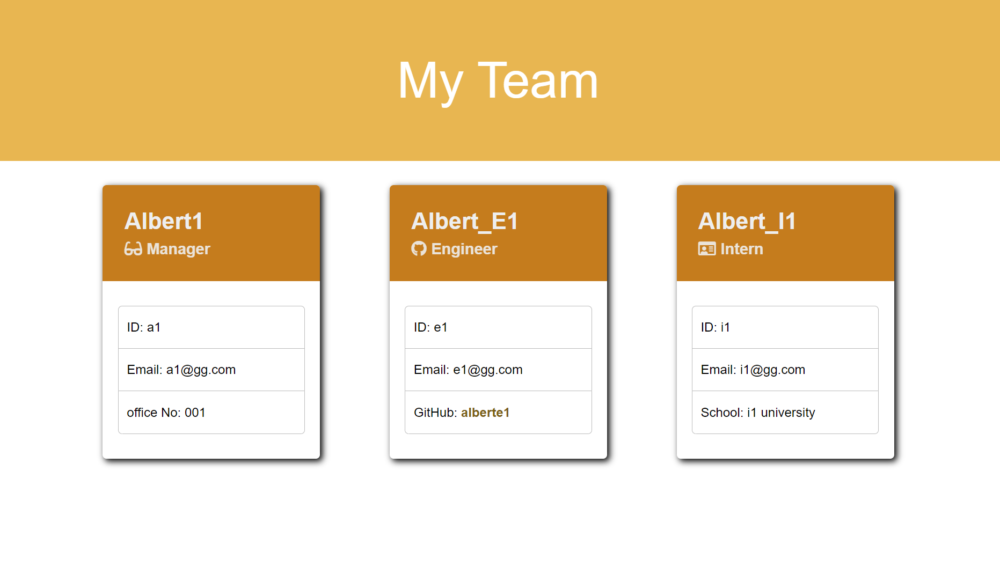
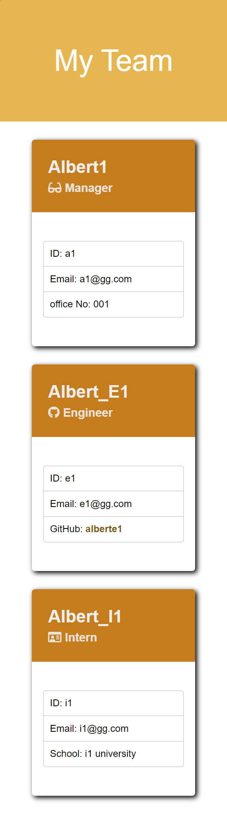

# **Team Profile Generator**

>## **_Description_**

This is a [`Node.js`](https://nodejs.org/en/) command-line application that takes in information about employees on a software engineering team and generates an HTML webpage that displays summaries for each person.

The html is demonstrating `managers`, `engineers`, and `interns` of the team. They have some common traits such as `Name`, `Id`, `Email`. But different role has different needs. Manager needs `office number`, engineer needs `GitHub account`, and intern needs `school name`.

---
### **_Table of Contents_**

* [Installation](#installation)
* [Usage](#usage)
* [Credits](#credits)
* [Features](#features)
* [Contribution](#contribution)
* [License](#license)

>## **_Installation_**
Please open your terminal and run either of these following code:
```
npm start
```
`or`
```
node app.js
```


>## **_Usage_**
In terminal, you will have to follow the instruction to enter some information about name, id, email, or some specials. For engineer, we need his/her GitHub account; for manager, we need his/her office number; and for intern, we need his/her school name.


**`Wider Screen`**



**`Mobile Screen`**




>## **_Credits_**

It took me almost one and a half week to finish this project. I think the hardest part is using node.js to generate a whole html file with bunch of variables. I have to make a static html file first, and copy coding into app.js to generate a dynamic html.

Testing js files in Jest.js is delightful. I can check my coding by just testing in Jest other than after inputting everything in prompt and to check html file.


>## **_Features_**
- Color change
    - to demonstrate different role by setting different color
- Cards Pop Out
    - to show his portfolio/Resume or the projects he/she is working on.
- More pages for adding/deleting
    - add/delete team members on the webpage


>## **_Contributing_**

❤️Albert Jiang, ❤️John Blackwell, ❤️Brandon Haynes


>## **_License_**


Copyright (c) [year] [fullname]

https://choosealicense.com/licenses/mit/

